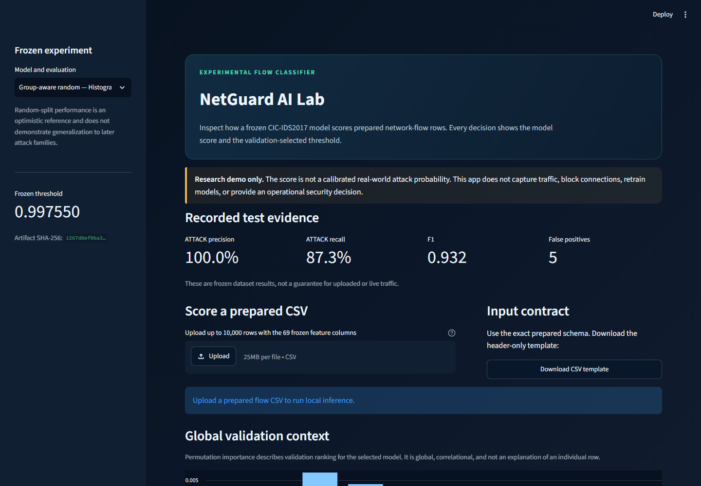
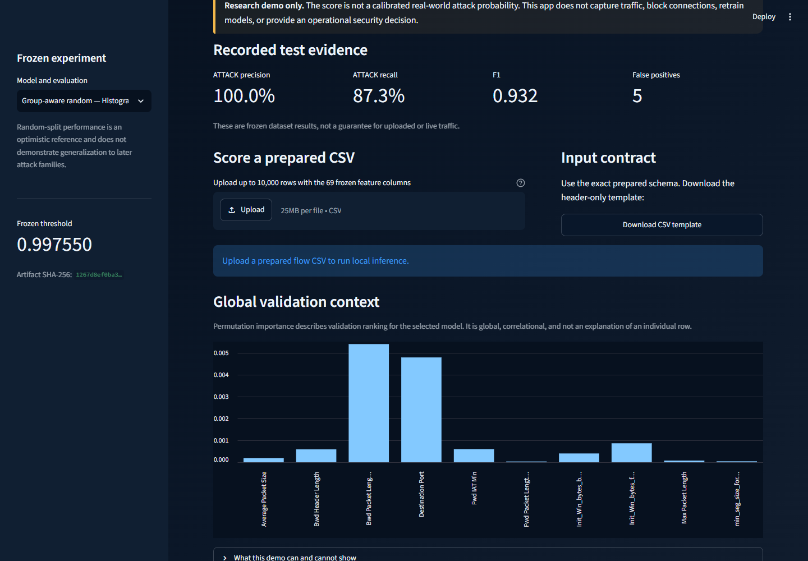
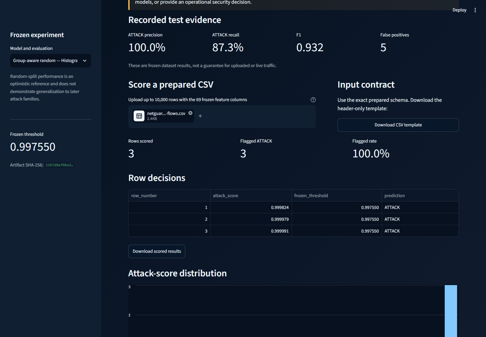
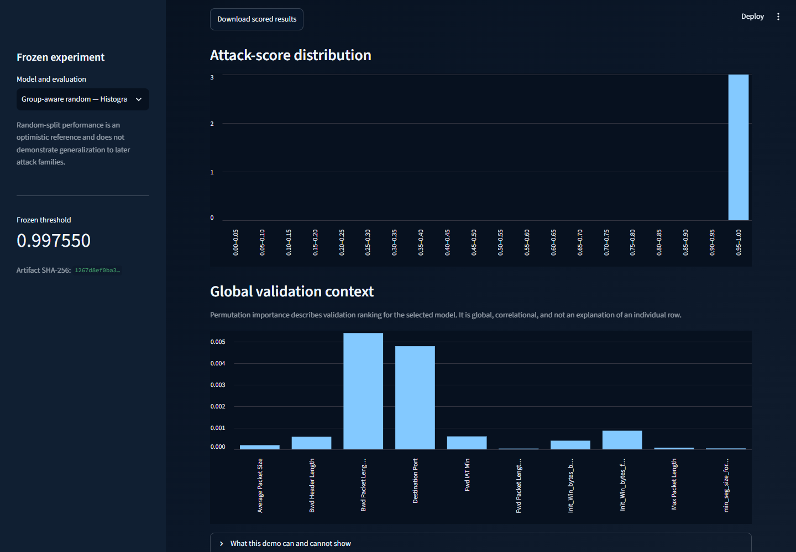

# Demo screenshots

## Scope

These screenshots document the local NetGuard AI Streamlit demo. They were
captured on 29 September 2026 from the frozen group-aware random HGB
configuration at a 1440 x 1000 desktop viewport.

No model was trained and no threshold was changed while preparing these assets.
The example upload contains three previously selected true-positive rows from
the frozen AI-15 test analysis. The generated CSV remains local and is ignored
by Git; only the rendered screenshots are published.

## Selected assets

### Demo overview

Shows the research boundary, frozen model, artifact identity, threshold, and
recorded test evidence.

### Frozen test evidence and input contract

Shows the recorded precision, recall, F1, false-positive count, CSV upload
contract, and validation-only global importance context.

### Local prediction results

Shows three prepared rows scored with the frozen model. All three exceed the
unchanged threshold and are labelled `ATTACK`. The screenshot demonstrates the
batch summary, per-row scores, threshold, and downloadable result path.

### Global validation context

Shows the uploaded sample's score distribution beside the validation-only
permutation-importance chart. The chart is correlational and does not explain
an individual prediction.

## Interpretation notes

- The overview states the research boundary and operational limitations.
- The prediction image demonstrates the complete local scoring flow.
- The validation-context image separates global importance from individual
  prediction explanations.
- Random-split metrics are not evidence of real-world deployment performance.

These images are documentation artifacts. They do not replace the automated
tests, frozen reports, model hashes, or reproducible release verification.
